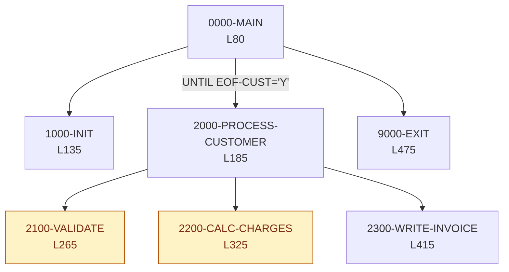
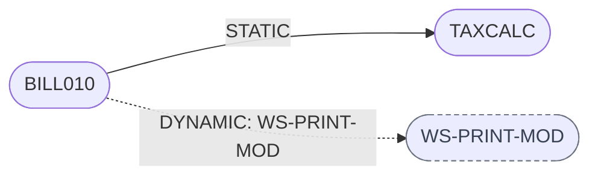
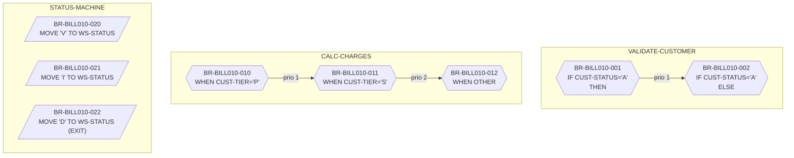
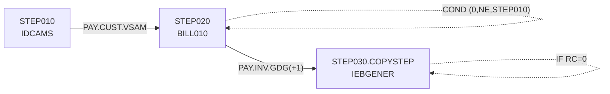
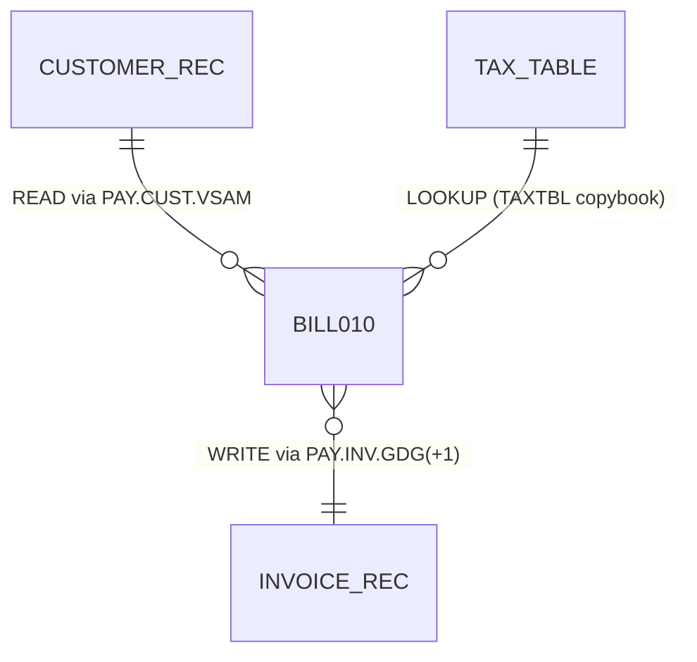
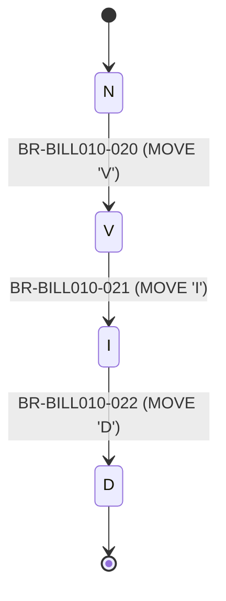

# Example output — `diagram-cobol-with-mermaid`

Given the three JSON excerpts in `example-input.md`, the skill writes the
following files under `out/diagrams/`. Node ids are slug+6-hex-hash; the hex
values shown here are illustrative (deterministic over the example bytes).

---

## `out/diagrams/INDEX.md`

````markdown
# Diagrams — BILL010

Generated by `diagram-cobol-with-mermaid` v1.0.

## Provenance

| Artifact                | sha256        | schemaVersion |
|-------------------------|---------------|---------------|
| program-profile.json    | f3a1…e9b2     | 1.0           |
| business-rules.json     | 7c0d…41af     | 1.0           |
| job-flow.json           | 22be…908c     | 1.0           |

## Table of contents

1. [Paragraph / PERFORM flow](#paragraph-flow)
2. [Static call graph](#call-graph)
3. [Business-rule decision tree](#rule-tree)
4. [JCL job DAG](#job-dag)
5. [Copybook ↔ dataset ER](#data-er)
6. [Status state machine](#state-machine)

## paragraph-flow



## call-graph



## rule-tree



## job-dag



## data-er



## state-machine



## Warnings

_(none)_
````

---

## File listing emitted

```
out/diagrams/
├── INDEX.md
├── call-graph.mmd
├── data-er.mmd
├── job-dag.mmd
├── paragraph-flow.mmd
├── rule-tree.mmd
└── state-machine.mmd
```

Each `.mmd` contains exactly the Mermaid block shown above between the
`%% diagram:` header and the file end (LF, single trailing newline).
Rerunning the skill on the same JSON bytes produces byte-identical files.

